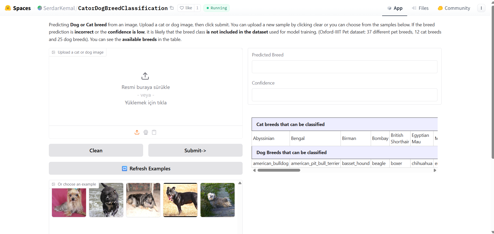
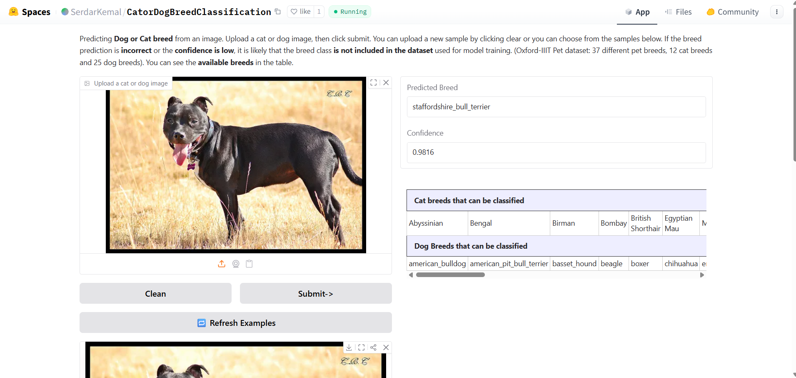
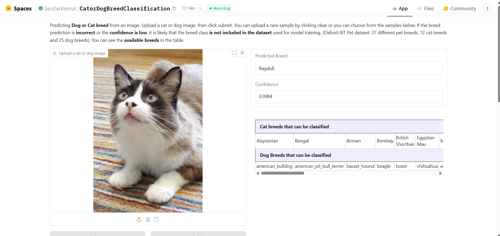

# CatDog Breed Classifier (FastAI)

Fine-tuning a vision model to classify cat and dog breeds using FastAI’s DataBlock API, transfer learning, and discriminative learning rates.

🌐 Live Demo (no install needed): Try it in your browser on Hugging Face Spaces: [cat/dog-breed-classifier](https://huggingface.co/spaces/SerdarKemal/CatorDogBreedClassification)

---

## 📚 Dataset

- **Oxford–IIIT Pet Dataset** (37 breeds; cats & dogs).

- Pulled directly via `fastai` helper: `untar_data(URLs.PETS)/'images'`.
 
- **Labeling rule**: file names follow `breed_###.jpg`. In the raw dataset, file name **case** happens to hint species (Cats often start uppercase, Dogs lowercase) — we do not rely on that for labels; instead we extract the **breed** with a regex and let FastAI handle the rest.

---

## What’s inside

- Download & inspect the data

- Build a **DataBlock** with transforms

- Train with **transfer learning** (ResNet34), then optionally **ResNet50** if accuracy is low

- Use **LR finder** and **discriminative learning rates**

- Interpret results (loss curves, top losses, confusion matrix)

- Simple **inference** helper

> Don’t want to set anything up? **Use the live Gradio demo on Hugging Face** (link above).

---

## Tech Stack

- **Language & Frameworks**: Python 3.10+ · PyTorch · FastAI

- **Vision & Models**: ResNet34 → ResNet50 (via FastAI/timm), ImageNet pretraining, mixed precision (`to_fp16`)

- **Data Pipeline**: FastAI DataBlock, `RegexLabeller`, on-the-fly augmentations (`aug_transforms`)

- **Evaluation**: accuracy metric, confusion matrix, top losses, saved plots (`loss_curve.png`, `top_losses.png`)
  
---

## Outputs & Artifacts

- `models/model_weights.pth`, raw trained weights (via `learn.save`)

- `models/model.pkl`, exported FastAI **Learner** (use this for Gradio/inference)

- `loss_curve.png`, `top_losses.png`, `confusion_matrix.png` - diagnostics

---

## Notes on techniques

- **Transfer learning** with ImageNet backbones (ResNet34 → ResNet50 if needed)

- **Learning-rate finder** to pick a reasonable `lr_max`

- **Discriminative LRs** via `slice(low, high)` when unfreezing

- **Mixed precision** (`to_fp16`) to speed up larger backbones

---

## Previews

<table>
  <tr>
    <td></td>
  </tr>
   <tr>
    <td></td>
  </tr>
   <tr>
    <td></td>
  </tr>
</table>

